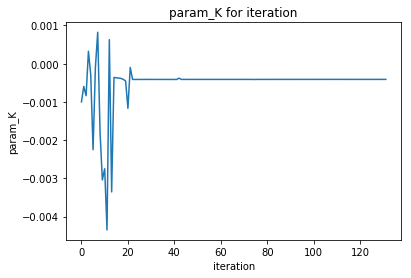

## results





## code 改动

+ 在bayes的acquire函数里implement全局的bounds，使得 bayes在探索新的x时，如果x越界，则做一个随机的尝试

  ​	


+ 在taper_output中 underK<0 or >3.5时，power_z关于param_K做一个线性延拓，而不是直接置零或负。避免了函数的间断
  + 

+ 修正了从32维向量到200维的分片线性映射
  + 


修改为

```
def convert_long(l,N=200):
    #result=[3.5]*66
    result = []
```

+ 修正超参gp_precisionmat与gp_lengthscales 的计算关系，并且将np.size(gp_precisionmat.shape) 从2修正为1，从而正确使用computeRBF而不是computeCBF来计算covariance
  + 

+ 在bayes的init里为RBF对应情况的lengthscale赋值


| m,n           | 0,0             | 1,-1         | 1,1         | 2,-2        | 2,0             | 2,2         | 3,-3         | 3,-1         | 3,-1         | 3,3          |
| ------------- | --------------- | ------------ | ----------- | ----------- | --------------- | ----------- | ------------ | ------------ | ------------ | ------------ |
| $\|Z_{m,n}\|$ | 170.242         | 0.398        | 0.551       | 0.748       | 846.311         | 0.220       | 0.385        | 1.226        | 1.522        | 0.289        |
| $Z_{m,n}$     | +83.19 +148.53j | +0.37 -0.14j | +0.39-0.39j | -0.74-0.13j | -429.30-729.34j | -0.22-0.00j | -0.35 +0.16j | -0.06 +1.23j | -1.16 +0.99j | +0.27 +0.10j |
|               |                 |              |             |             |                 |             |              |              |              |              |

